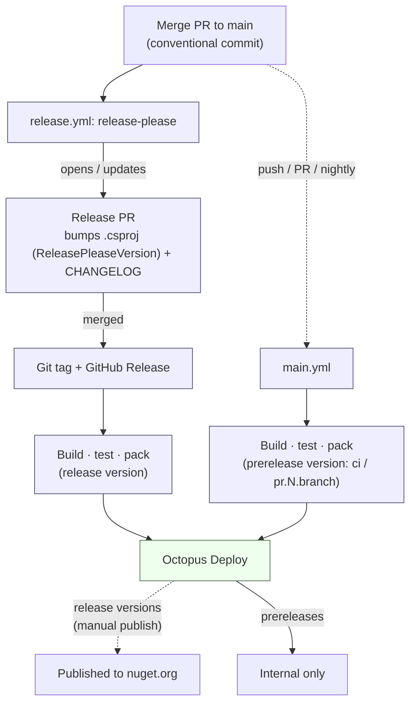

# Releasing

Versioning and publishing are automated — there is no manual version bump and no hand-cut GitHub
release. Release Please owns the version and changelog; GitHub Actions builds, tests, and packs the
package; and Octopus Deploy publishes release versions to nuget.org.

This repo is the reference the Java and TS providers converge on (see DEVEX-318).

## Pipeline

- **Prerelease builds** — pushes to `main` (`ci`), PRs (`pr.<number>.<branch>`), and the nightly
  schedule — are also handed to Octopus Deploy, but their versions stay internal and are not
  published to nuget.org. `--version-suffix` moves the package version (and
  `AssemblyInformationalVersion`); `AssemblyVersion`/`FileVersion` stay at the release base.
- **Release builds** run only after a Release Please PR is merged; the packaged artifact is handed to
  Octopus Deploy, from which the release version is published to nuget.org by a manual action.

## Cutting a release

1. Land changes on `main` using [conventional commits](https://www.conventionalcommits.org/)
   (`fix:` → patch, `feat:` → minor, `feat!:`/`BREAKING CHANGE` → major).
2. Release Please opens a **release PR** that bumps the version and updates the changelog.
3. Merge the release PR. The tag, GitHub release, build, and push to Octopus Deploy run
   automatically.
4. Publish the release to nuget.org manually from Octopus Deploy.
5. Confirm the artifact at <https://www.nuget.org/packages/Octopus.OpenFeature>.
