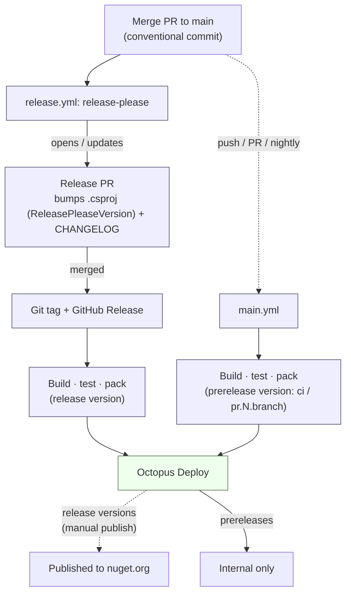

# Releasing

Versioning and publishing are automated. Release Please owns the version and changelog; GitHub Actions builds, tests, and packs the package; and Octopus Deploy publishes release versions to nuget.org.

## Pipeline

- **Release builds** run after a Release Please PR is merged; the packaged artifact is pushed to Octopus Deploy, from which the release version is published to nuget.org by a manual action.
- **Prerelease builds** run on pushes to `main`, the nightly schedule, and manual dispatches (all tagged `ci`), and PRs (`pr.<number>.<branch>`). These are pushed to Octopus Deploy and stay internal, except for fork PRs and Dependabot branches, which upload the bundle as a GitHub Actions artifact instead.

## Cutting a release

1. Merge changes to `main` using a [conventional commit message](https://www.conventionalcommits.org/).
2. Release Please opens or updates a **release PR** that bumps the version and updates the changelog.
3. Merge the release PR. The tag, GitHub release, build, and push to Octopus Deploy run automatically.
4. Promote the release to nuget.org manually from Octopus Deploy.
5. Confirm the artifact in [NuGet](https://www.nuget.org/packages/Octopus.OpenFeature).
